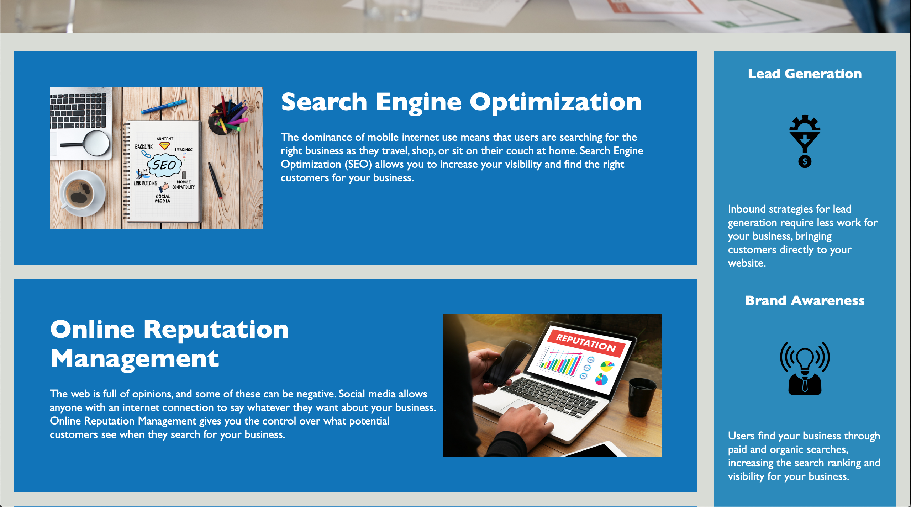

# Horiseon Website
# Website Update
Carly Jackson

For the client, Horiseon, we refactored their existing code, and therefore, website, using HTML semantic structure to build and improve their current website to the set of standards of new technology, as well as optimising the site for search engines. In doing this, the following semantic elements were incorporated: article, aside, header and footer, sucessfully replacing the vastly used division element.

# LINKS
# Link to GitHub Homework Repository webpage
https://github.com/caarlyjackson/homework00

# Link to Homework Webpage
https://caarlyjackson.github.io/homework00/

# SCREENSHOTS

